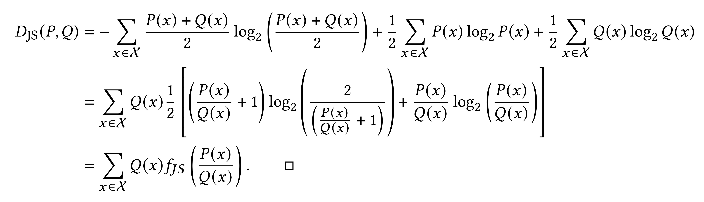
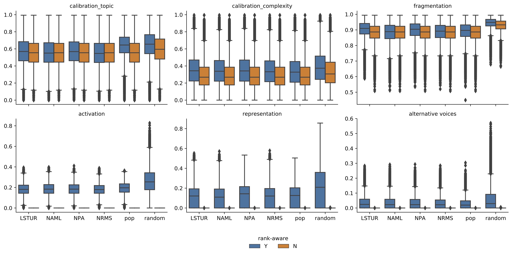

RADio
================

  - [1 Computing RADio with rank-aware
    JS-divergence](#computing-radio-with-rank-aware-js-divergence)
  - [2 Additional Material](#additional-material)
      - [2.1 Jensen Shannon as an
        f-Divergence](#jensen-shannon-as-an-f-divergence)
      - [2.2 RADio with KL divergence](#radio-with-kl-divergence)
      - [2.3 Jensen-Shannon divergence Kullback-Leibler divergence with
        and without
        rank-awareness](#jensen-shannon-divergence-kullback-leibler-divergence-with-and-without-rank-awareness)
      - [2.4 Jensen-Shannon divergence for all recommender strategies
        without
        cutoff](#jensen-shannon-divergence-for-all-recommender-strategies-without-cutoff)

This repository contains the supporting material for the paper 📻 *RADio
– Rank-Aware Divergence metrIcs to measure nOrmative diversity in news
recommendations*.

# 1 Computing RADio with rank-aware JS-divergence

    git clone https://anonymous.4open.science/r/RADio/
    pip install -f requirements.txt
    python metrics_calculations.py

# 2 Additional Material

## 2.1 Jensen Shannon as an f-Divergence

## 2.2 RADio with KL divergence

<table>

<caption>

RADio framework with DART metrics based on KL divergence with
recommendation algorithms on the MIND dataset. From left to right:
Calibration (topic), Calibration (complexity), Fragmentation,
Activation, Representation and Alternative Voices. These metrics are
executed on a random sample of 35.000 users, with rank-awareness, and
without cutoff point.

</caption>

<thead>

<tr>

<th style="text-align:left;">

rec\_type

</th>

<th style="text-align:right;">

calibration\_topic

</th>

<th style="text-align:right;">

calibration\_complexity

</th>

<th style="text-align:right;">

fragmentation

</th>

<th style="text-align:right;">

affect

</th>

<th style="text-align:right;">

representation

</th>

<th style="text-align:right;">

alternative\_voices

</th>

</tr>

</thead>

<tbody>

<tr>

<td style="text-align:left;">

lstur

</td>

<td style="text-align:right;">

2.6038

</td>

<td style="text-align:right;">

1.1432

</td>

<td style="text-align:right;">

7.7201

</td>

<td style="text-align:right;">

0.1481

</td>

<td style="text-align:right;">

0.1078

</td>

<td style="text-align:right;">

0.0142

</td>

</tr>

<tr>

<td style="text-align:left;">

naml

</td>

<td style="text-align:right;">

2.5333

</td>

<td style="text-align:right;">

1.1287

</td>

<td style="text-align:right;">

7.3926

</td>

<td style="text-align:right;">

0.1531

</td>

<td style="text-align:right;">

0.1047

</td>

<td style="text-align:right;">

0.0127

</td>

</tr>

<tr>

<td style="text-align:left;">

npa

</td>

<td style="text-align:right;">

2.5945

</td>

<td style="text-align:right;">

1.1390

</td>

<td style="text-align:right;">

7.6202

</td>

<td style="text-align:right;">

0.1521

</td>

<td style="text-align:right;">

0.1237

</td>

<td style="text-align:right;">

0.0134

</td>

</tr>

<tr>

<td style="text-align:left;">

nrms

</td>

<td style="text-align:right;">

2.5013

</td>

<td style="text-align:right;">

1.1204

</td>

<td style="text-align:right;">

7.4519

</td>

<td style="text-align:right;">

0.1442

</td>

<td style="text-align:right;">

0.1114

</td>

<td style="text-align:right;">

0.0113

</td>

</tr>

<tr>

<td style="text-align:left;">

pop

</td>

<td style="text-align:right;">

2.9384

</td>

<td style="text-align:right;">

1.1082

</td>

<td style="text-align:right;">

7.6377

</td>

<td style="text-align:right;">

0.1605

</td>

<td style="text-align:right;">

0.1028

</td>

<td style="text-align:right;">

0.0102

</td>

</tr>

<tr>

<td style="text-align:left;">

random

</td>

<td style="text-align:right;">

3.6038

</td>

<td style="text-align:right;">

1.5985

</td>

<td style="text-align:right;">

8.6295

</td>

<td style="text-align:right;">

0.8079

</td>

<td style="text-align:right;">

1.1248

</td>

<td style="text-align:right;">

0.0420

</td>

</tr>

</tbody>

</table>

## 2.3 Jensen-Shannon divergence Kullback-Leibler divergence with and without rank-awareness

Jensen-Shannon divergence for each DART metric, with and without
rank-awareness, with a cutoff @10. Boxplot with median and the
interquartile range in the inner box.

Kullback-Leibler divergence for each DART metric, with and without
rank-awareness, with a cutoff @10. Boxplot with median and the
interquartile range in the inner box.

## 2.4 Jensen-Shannon divergence for all recommender strategies without cutoff

Jensen-Shannon divergence for each DART metric for all neural
recommender strategies, with and without rank-awareness, and without a
cutoff. Without rank-awareness and cutoff no divergence is found for the
Activation, Representation and Alternative Voices metrics, as in these
cases the recommendation and the context are identical. Boxplot with
median and the interquartile range in the inner box.

